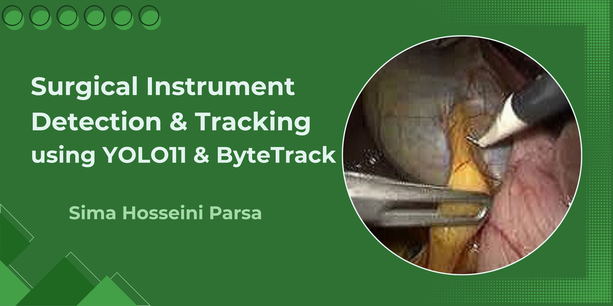
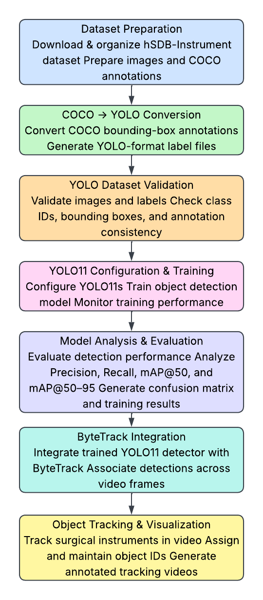
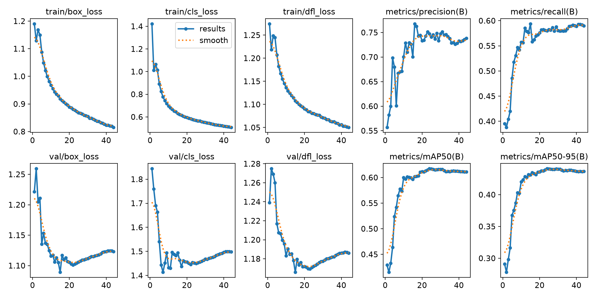
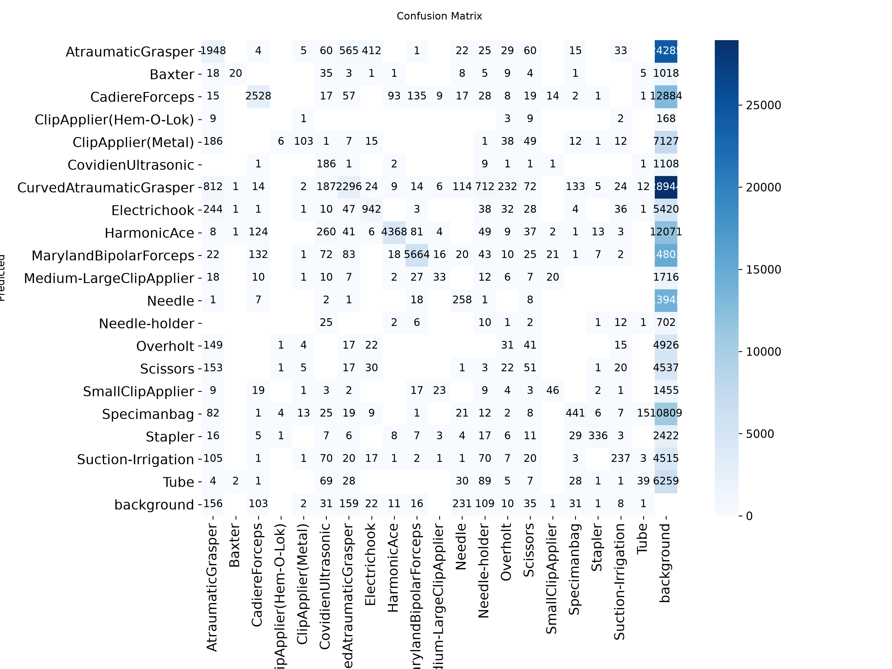
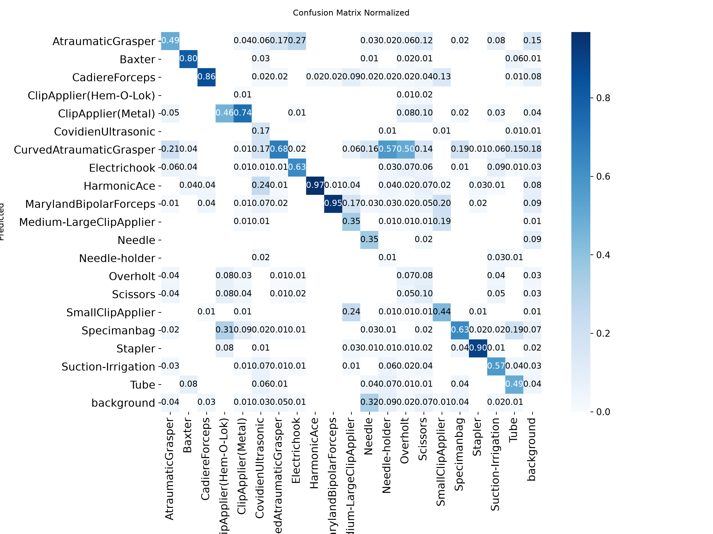

<p align="center">
  
</p>

# Surgical-Instrument-Detection-and-Tracking-using-YOLO11-and-ByteTrack

## Overview

This project presents an end-to-end computer vision pipeline for surgical instrument detection and multi-object tracking in endoscopic videos using YOLO11 and ByteTrack.
The hSDB-instrument dataset is prepared from COCO-format annotations by merging component-level annotations into instrument-level classes and converting the annotations to the YOLO format. A pretrained YOLO11s model is then fine-tuned on the resulting 20-class dataset for surgical instrument detection.
The trained detector is then integrated with ByteTrack to match detections across consecutive video frames and assign persistent tracking identities. The pipeline combines quantitative object detection evaluation with qualitative visualization of the final tracking output.
The project is designed as a portfolio-level computer vision implementation demonstrating the complete workflow from dataset preparation and model training to object detection evaluation and multi-object tracking.

## Key Features

- Surgical instrument detection using YOLO11s
- Transfer learning from pretrained YOLO11s weights
- 20-class instrument-level detection
- Conversion of COCO annotations to YOLO format
- Merging of component-level instrument annotations
- Automated annotation validation
- Object detection evaluation using Precision, Recall, mAP@50, and mAP@50–95
- Standard and normalized confusion matrices
- Multi-object tracking using ByteTrack
- Persistent tracking identities across consecutive video frames
- Qualitative tracking visualization through an output video
- GPU-accelerated training using PyTorch and CUDA

## Dataset

The project uses the **hSDB-instrument** dataset, which contains surgical video data from laparoscopic cholecystectomy and robotic gastrectomy procedures.
For this project, the real-data subsets from **Chole** and **Gastric** procedures are used. The original annotations are provided in COCO format and contain component-level annotations for surgical instruments.
Different instrument components, including heads, bodies, wrists, clips, and tips, are merged into their corresponding instrument-level categories. The resulting annotations are converted into YOLO format for model training.
The final dataset contains **20 instrument classes**. Ligasure is excluded because it appears in the validation annotations but has no corresponding training instances.

## Dataset Preparation

The dataset preparation workflow includes:

1. Loading COCO annotations.
2. Identifying instrument categories and annotated components.
3. Merging component-level annotations into instrument-level classes.
4. Converting COCO bounding boxes to normalized YOLO format.
5. Combining Chole and Gastric subsets.
6. Prefixing image names to avoid naming conflicts.
7. Creating separate training and validation image/label directories.
8. Validating image-label correspondence and annotation validity.

**Note:** The original hSDB-instrument dataset is not included in this repository due to its size.

## Project Structure

```text
Surgical-Instrument-Detection-and-Tracking-using-YOLO11-and-ByteTrack/
│
├── README.md
├── project_report.pdf
├── requirements.txt
│
├── configs/
│   └── data.yaml
│
├── inputs/
│   └── test_video.mp4
│
├── notebooks/
│   └── hsdb_yolo_bytetrack.ipynb
│
├── images/
│   ├── pipeline.png
│   └── surgical_banner.png
│
└── results/
    ├── training_results.png
    ├── confusion_matrix.png
    ├── confusion_matrix_normalized.png
    └── tracking_video.mp4
```
## Project Pipeline

The overall workflow consists of the following stages:
<p align="center">
  
  </p>

<p align="center">
  Figure 1. Overall pipeline of the surgical instrument detection and tracking system.
  </p>

## Data Preprocessing

No separate manual image preprocessing pipeline is implemented in the notebook. Image resizing and other required preprocessing operations are handled internally by the Ultralytics YOLO training and prediction pipeline.
The training, validation, and prediction stages use an input image size of **640 × 640 pixels**.
The annotation preprocessing stage converts the original COCO annotations into YOLO format.
Component suffixes such as `_head, _body, _wrist, _clip,` and `_tip` are removed during class merging so that different components belonging to the same instrument are represented by a unified instrument-level class.
The resulting bounding boxes are converted into the YOLO format:
`class_id x_center y_center width height`
All bounding-box coordinates are normalized relative to the image dimensions.
The generated annotations are validated by checking:

- YOLO annotation format
- Class ID ranges
- Normalized bounding-box coordinates
- Image-label correspondence
- Missing or orphan label files
  
No additional manually defined image filtering, normalization, or augmentation pipeline is applied.

## Training Configuration

The YOLO11s model is fine-tuned using pretrained weights on the prepared 20-class dataset.

| Parameter	| Configuration |
|---|---|
| Model |	YOLO11s |
| Initialization |	Pretrained weights |
| Number of classes |	20 |
| Input image size |	640 × 640 |
| Maximum epochs |	100 |
| Batch size |	16 |
| Early stopping patience |	20 |
| Data loader workers |	4 |
| Device |	GPU 0 |

Training uses the augmentation and preprocessing mechanisms provided internally by the Ultralytics YOLO framework rather than a separately implemented custom augmentation pipeline.
The best checkpoint generated during training is subsequently used for validation, prediction, and ByteTrack tracking.

## Results

The trained YOLO11s model achieved the following validation performance on the 20-class surgical instrument dataset.

## Results Summary

| Metric	| Value |
|---|---|
| Precision	| 0.7473 |
| Recall | 0.5801 |
| mAP@50	| 0.6172 |
| mAP@50–95 |	0.4408 |

The reported values correspond to the selected `best.pt` checkpoint, obtained at **epoch 24**.

## Training Performance

The training process records object detection metrics and loss components throughout the training epochs, including:

- Box loss
- Classification loss
- Distribution Focal Loss
- Precision
- Recall
- mAP@50
- mAP@50–95

<p align="center">
  
  </p>
  
<p align="center">
  Figure 2. Training and validation losses and object detection performance metrics during YOLO11s training.
  </p>

## Confusion Matrix

A standard confusion matrix is generated during validation to examine class-level detection and classification behavior across the 20 instrument classes.

<p align="center">
  
  </p>

<p align="center">  
  Figure 3. Confusion matrix on the validation dataset.
  </p>
  
A normalized confusion matrix is also provided to show the relative prediction distribution across classes.

<p align="center">
  
  </p>

<p align="center">
  Figure 4. Normalized confusion matrix on the validation dataset.
  </p>

## Tracking Visualization

The trained YOLO11s detector is integrated with ByteTrack to track detected surgical instruments across consecutive video frames.
ByteTrack assigns persistent tracking identities to detected instruments, allowing individual detections to be associated over time.
Three confidence thresholds **(0.15, 0.25, and 0.35)** were qualitatively compared for the tracking stage. A confidence threshold of **0.25** was selected for the final tracking output based on qualitative inspection.
A shortened segment of the resulting tracking video is provided for visualization.

[View Tracking Video](results/tracking_video.mp4)

The tracking output is provided for qualitative visualization. Multi-object tracking metrics are not included in the current evaluation pipeline.

## Installation

Clone the repository:

`git clone https://github.com/SimaHosseiniParsa/Surgical-Instrument-Detection-and-Tracking-using-YOLO11-and-ByteTrack.git
cd Surgical-Instrument-Detection-and-Tracking-using-YOLO11-and-ByteTrack`

Create and activate a virtual environment:

`python -m venv venv`

On Windows:

`venv\Scripts\activate`

On Linux/macOS:

`source venv/bin/activate`

Install the required dependencies:

```bash
pip install -r requirements.txt
```

## Usage

The complete implementation is provided in the Jupyter notebook:

`notebooks/hsdb_yolo_bytetrack.ipynb`

The notebook contains the complete workflow, including:

1. Loading COCO annotations
2. Exploring dataset classes
3. Merging instrument components
4. Converting COCO annotations to YOLO format
5. Creating the YOLO dataset structure
6. Validating YOLO annotations
7. Creating the YOLO configuration file
8. Loading YOLO11
9. Training the detection model
10. Analyzing training results
11. Evaluating the trained model
12. Integrating ByteTrack for multi-object tracking

The dataset paths in `configs/data.yaml` should be adjusted according to the local dataset location before training.

## Requirements

The project uses the following main software components:

- Python 3.12
- PyTorch 2.11.0
- CUDA 12.8
- Ultralytics YOLO 8.4.112
- OpenCV
- Pandas 3.0.3
- Matplotlib 3.11.1
- IPython 9.15.0
- PyYAML 6.0.3
  
The complete dependency list is provided in:

`requirements.txt`

GPU acceleration is recommended for model training.

## Acknowledgments

This project uses the **hSDB-instrument dataset** for surgical instrument detection and tracking.
The object detection pipeline is implemented using the **Ultralytics YOLO framework**, while **ByteTrack** is used for multi-object tracking.
The hSDB-instrument dataset was introduced by Yoon et al. at MICCAI 2021:

[Dataset reference](https://hsdb-instrument.github.io/)

The test video used for qualitative tracking visualization was adapted from Video S1 of Kawai et al. (2025) and is distributed under the **Creative Commons Attribution-NonCommercial 4.0 (CC BY-NC 4.0) license**:

[Input video reference](https://pmc.ncbi.nlm.nih.gov/articles/PMC12660028/)

The project also builds upon the original hSDB-instrument dataset annotations and the open-source computer vision frameworks used throughout the implementation.

## Future Improvements

Several extensions could further improve the current system:

- Evaluate larger YOLO11 variants such as YOLO11m, YOLO11l, or YOLO11x and compare their detection accuracy and computational cost with YOLO11s.
- Perform systematic experiments with different data augmentation strategies.
- Conduct controlled hyperparameter experiments involving learning rate, batch size, and training schedules.
- Evaluate the tracking component using dedicated multi-object tracking metrics.
- Improve prediction speed and hardware usage for real-time deployment.
- Evaluate the system on additional surgical datasets and more diverse video sequences to assess generalization across different surgical procedures and visual conditions.
